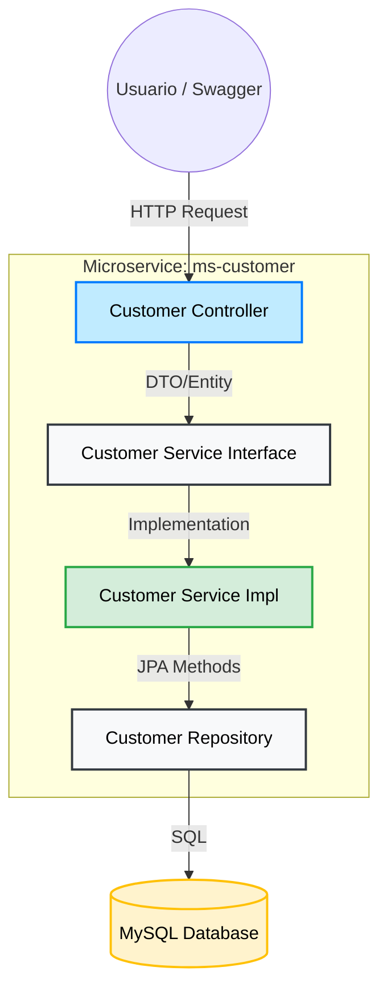
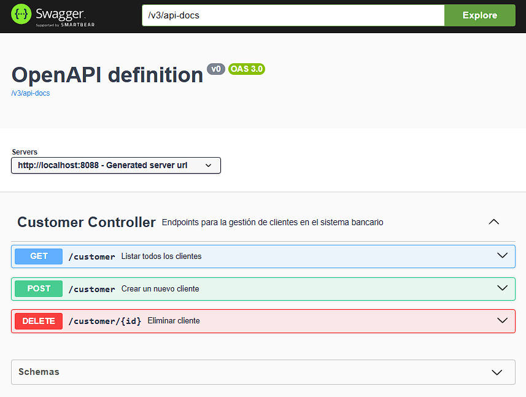
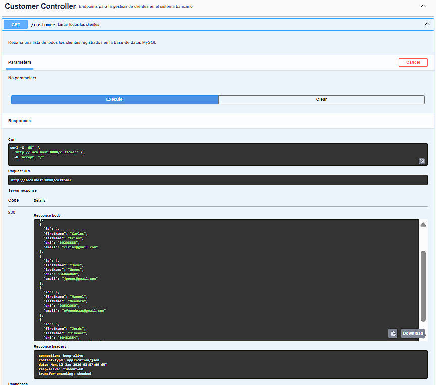
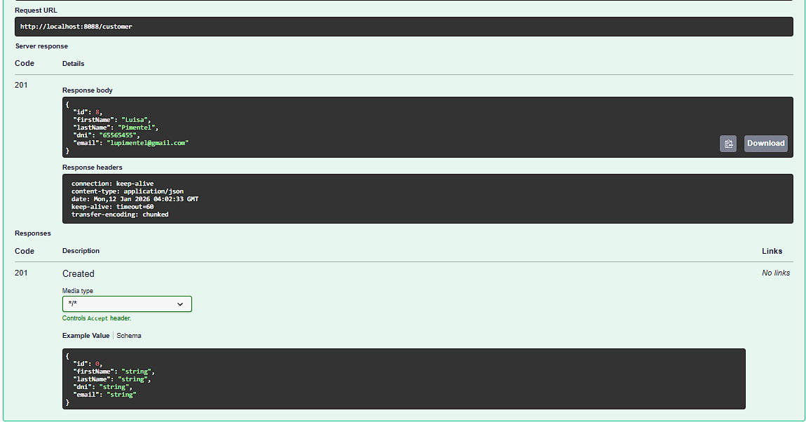
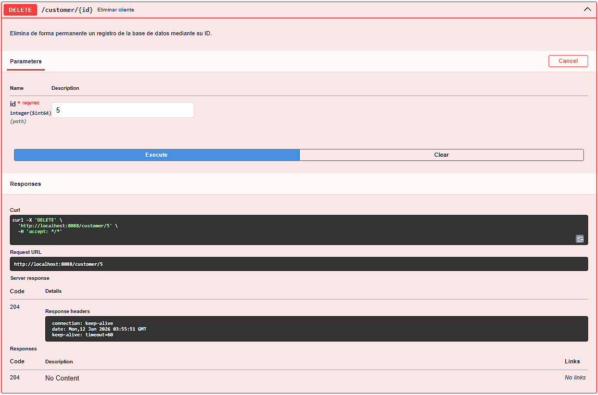
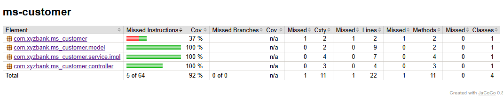

# 🛡️ Microservicio de Gestión de Clientes (ms-customer)

<p align="center">
  
  
  
  
  
</p>
Este microservicio forma parte del ecosistema **Bank System** y es el encargado de administrar la información de los clientes (Personales y Empresariales), asegurando la integridad de los datos y proporcionando la base para la apertura de productos bancarios.
---
## 🚀 Tecnologías y Herramientas

* **Java 17**: Lenguaje principal.
* **Spring Boot 3.3.6**: Framework base.
* **Spring Data JPA**: Abstracción de persistencia de datos.
* **MySQL**: Base de datos relacional para gestión de perfiles.
* **Lombok**: Reducción de código boilerplate.
* **SpringDoc OpenAPI 3**: Documentación interactiva de la API basada en el estándar OpenAPI 3.
* **Jakarta Persistence API**: Estándar de mapeo objeto-relacional.
---
## 🏗️ Diagrama de Arquitectura (Patrón de Capas)


---
## 📋 Funcionalidades del Sistema

* **Registro de Clientes**: Gestión de clientes con validaciones de campos obligatorios.
* **Tipificación**: Diferenciación lógica entre clientes Personales y Empresariales.
* **Validación de Identidad**: Integridad de datos para campos únicos (DNI/RUC).
* **API Documentation**: Documentación de endpoints accesible vía Swagger.
---
## ⚙️ Ejecución en Local

### Requisitos
* JDK 17
* Maven 3.6+
* MySQL Server

### Pasos
1. Clonar el repositorio.
2. Configurar la base de datos en el archivo `src/main/resources/application.properties`.
3. Ejecutar los tests y verificar cobertura:
    ```bash
   mvn clean test
   
4. Levantar el servicio:
   ```bash
   mvn spring-boot:run   
---
## 📸 API Demo

---
### 🖥️ Interfaz de Documentación (Swagger)

El proyecto utiliza **SpringDoc OpenAPI 3** para generar documentación interactiva y estandarizada. Una vez ejecutado el microservicio, puedes acceder a la consola de pruebas en:

* 🔗 **Swagger UI:** [http://localhost:8088/swagger-ui/index.html](http://localhost:8088/swagger-ui/index.html)



### 🚀 Demostración de Endpoints (API Demo)
A continuación, se muestran capturas de las operaciones principales realizadas desde la interfaz:

#### 1. Consulta de Clientes (GET)
Permite obtener la lista completa de clientes desde la base de datos MySQL.


#### 2. Registro de Nuevo Cliente (POST)
Envío de datos en formato JSON. Al procesar la solicitud, el sistema devuelve un estado `201 Created` y el objeto con su ID generado.


#### 3. Eliminación de Clientes (DELETE)
Eliminación física del registro mediante su identificador único, retornando un estado `204 No Content`.

*Muestra la integración exitosa entre el controlador REST y la persistencia en MySQL.*

### 📄 Estructura de Datos (JSON)
<details>
  <summary>Ver ejemplo de respuesta extendida</summary>

  ```json
  [
   {
      "id": 1,
      "firstName": "Pedro",
      "lastName": "Perez",
      "dni": "10203050",
      "email": "pedro@gmail.com"
   },
   {
      "id": 2,
      "firstName": "Carlos",
      "lastName": "Frias",
      "dni": "10208888",
      "email": "cfrias@gmail.com"
   },
   {
      "id": 8,
      "firstName": "Luisa",
      "lastName": "Pimentel",
      "dni": "65565455",
      "email": "lupimentel@gmail.com"
   },
    ...
  ]
  ```
</details>

---
## 📈 Calidad del Proyecto y Cobertura

Para garantizar la robustez del sistema bancario, este proyecto implementa un pipeline de calidad estricto basado en tres pilares:

### 1. Pruebas Unitarias y Mocking
* **JUnit 5** y **Mockito**: Se asegura el correcto funcionamiento de la lógica de negocio (capas de Controller y Service) de forma aislada mediante el uso de objetos simulados.

### 2. Análisis de Cobertura (JaCoCo)
* **Umbral mínimo:** Se ha configurado una regla de calidad con un mínimo del 80%.
* **Resultado Actual:** **92% de cobertura de instrucciones**.
* **Reporte Visual:**
  

### 3. Estilo y Estándares (Checkstyle)
* Se utiliza el plugin de **Checkstyle** con la configuración `checkstyle.xml` para garantizar que el código sea limpio, legible y siga las convenciones de la industria.
-----
## 📬 Contacto y Autoría

Este proyecto fue desarrollado por **NellyCN** como parte de la certificación en arquitectura de microservicios.

* **GitHub:** [@NellyCN](https://github.com/NellyCN)
* **Proyecto:** Sistema Bancario XYZ - Fase 1: Microservicio de Clientes.
* **Estado:** 🚀 Completado y Testeado.

---
<p align="center">
  Hecho con ❤️ para el ecosistema Bank System
</p>