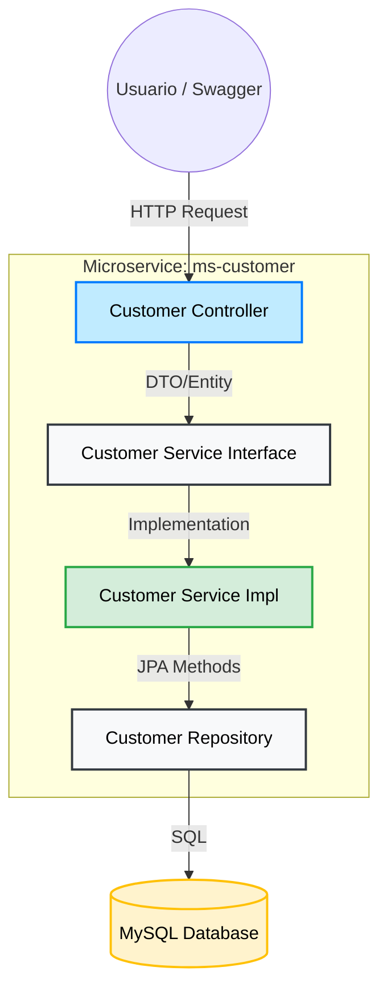

# 🛡️ Microservicio de Gestión de Clientes (ms-customer)


Este microservicio forma parte del ecosistema **Bank System** y es el encargado de administrar la información de los clientes (Personales y Empresariales), asegurando la integridad de los datos y proporcionando la base para la apertura de productos bancarios.

## 🚀 Tecnologías y Herramientas

* **Java 17**: Lenguaje principal.
* **Spring Boot 3.3.6**: Framework base.
* **Spring Data JPA**: Abstracción de persistencia de datos.
* **MySQL**: Base de datos relacional para gestión de perfiles.
* **Lombok**: Reducción de código boilerplate.
* **SpringDoc OpenAPI**: Documentación interactiva de la API basada en el estándar OpenAPI 3.
* **Jakarta Persistence API**: Estándar de mapeo objeto-relacional.

---

## 🛠️ Calidad de Código y Pruebas

Este proyecto pone un fuerte énfasis en la **estabilidad y mantenibilidad**, implementando:

### 1. Pruebas Unitarias y Mocking
* Uso de **JUnit 5** y **Mockito** para asegurar el correcto funcionamiento de la lógica de negocio de forma aislada.

### 2. Cobertura de Código (JaCoCo)
El proyecto incluye el plugin de **JaCoCo** con una regla de calidad estricta:
* **Umbral mínimo de cobertura:** 80% de las instrucciones.
* Generación automática de reportes de cobertura tras la fase de test.

### 3. Estilo de Código (Checkstyle)
* Se aplica el plugin de **Checkstyle** para garantizar que el código siga los estándares definidos en `checkstyle.xml`, promoviendo un código limpio y legible para el equipo.

---

## 📋 Funcionalidades del Sistema

* **Registro de Clientes**: Gestión de clientes con validaciones de campos obligatorios.
* **Tipificación**: Diferenciación lógica entre clientes Personales y Empresariales.
* **Validación de Identidad**: Integridad de datos para campos únicos (DNI/RUC).
* **API Documentation**: Documentación de endpoints accesible vía Swagger.

---

## ⚙️ Ejecución en Local

### Requisitos
* JDK 17
* Maven 3.6+
* MySQL Server

### Pasos
1. Clonar el repositorio.
2. Configurar la base de datos en el archivo `src/main/resources/application.properties`.
3. Ejecutar los tests y verificar cobertura:
    ```bash
   mvn clean test
   
4. Levantar el servicio:
   ```bash
   mvn spring-boot:run   
---
## 🏗️ Diagrama de Arquitectura (Patrón de Capas)


-----
## 📸 API Demo

-----
## 🖥️ Interfaz de Documentación (Swagger)

El proyecto utiliza **SpringDoc OpenAPI** para generar documentación interactiva. Una vez ejecutado, puedes acceder en: `http://localhost:8088/swagger-ui/index.html`

### Ejemplo de respuesta (GET /customer):
Consulta de Clientes:
*Muestra la integración exitosa entre el controlador REST y la persistencia en MySQL.*

### 📄 Ejemplo de Respuesta JSON
<details>
  <summary>Haz clic aquí para ver el JSON completo obtenido de la API</summary>

  ```json
  [
   {
      "id": 1,
      "firstName": "Pedro",
      "lastName": "Perez",
      "dni": "10203050",
      "email": "pedro@gmail.com"
   },
   {
      "id": 2,
      "firstName": "Carlos",
      "lastName": "Frias",
      "dni": "10208888",
      "email": "cfrias@gmail.com"
   },
   {
      "id": 3,
      "firstName": "José",
      "lastName": "Gomes",
      "dni": "06044040",
      "email": "jgomes@gmail.com"
   },
    ...
  ]
  ```
</details>

-----
## 📈 Calidad del Proyecto (Code Coverage)

Para garantizar la robustez del sistema bancario, hemos implementado pruebas unitarias e integración con **JUnit 5** y **Mockito**.

- **Cobertura Total:** 88%
- **Herramienta:** JaCoCo

Reporte de Cobertura:

-----

## 📬 Contacto
* Desarrollado por [NellyCN](https://github.com/NellyCN) 
* Proyecto: Final Bank System - Fase Microservicios - ms-customer